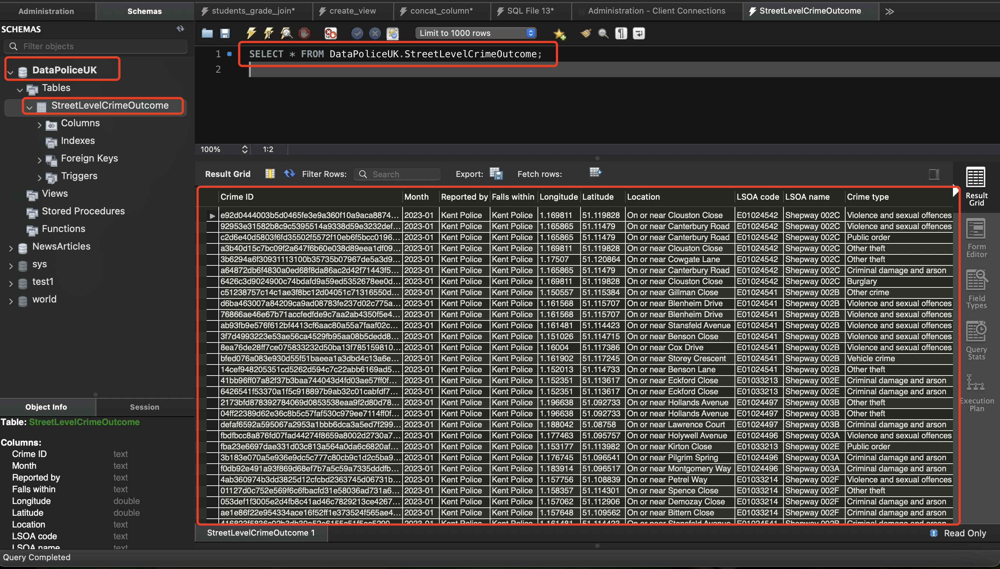
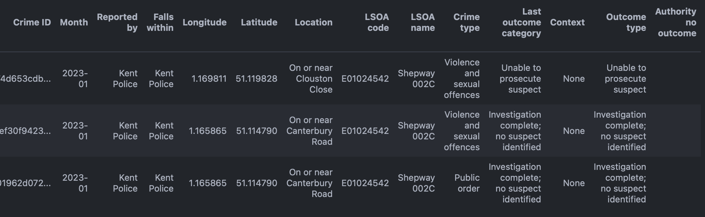
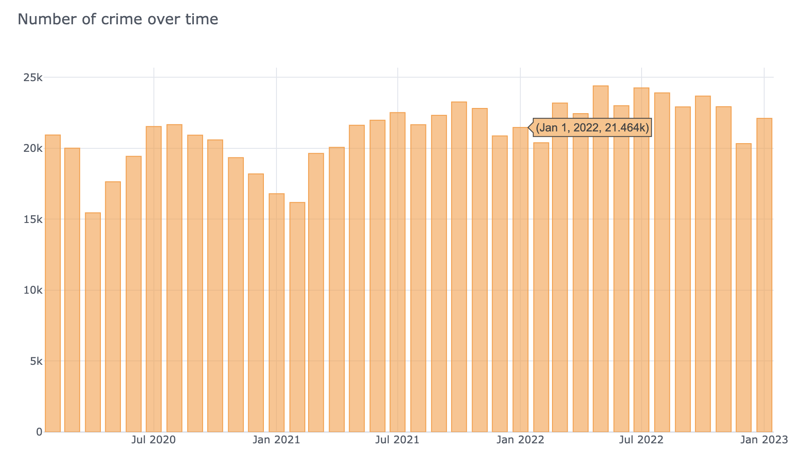

# DataPoliceUK

The objective of this repo are below:

* Using the [Police UK API ](https://data.police.uk)extract the data related to `street-level crime` and `outcome` data as well as `the nearest police stations`.

* Create a single database that will contain all the street level crime and outcome data with the nearest police station that have investigated the crimes and remove all the data that have a missing outcome while highlighting which authorities do not provide an outcome.

* Present a sample of your data with the code and a brief document explaining your thought process for the technologies you have selected.

My thoughts to make it is below, details is in notebook `Police_UK_API.ipynb`

For a simple demo see `Police_UK_API_lite.ipynb`

|   | task                 | tools                            | notes                                          |
| - | -------------------- | -------------------------------- | ---------------------------------------------- |
| 1 | download data        | `wget`,`police-api-client`   | archived data                                  |
| 2 | prepare data         | `pandas`                       | read all .csv files from multiple folders      |
| 3 | descriptive analysis | `pandas`,`police-api-client` | check missing values,columns                   |
| 4 | data vistualization  | `plotly`, `cufflinks`        | vistualise                                     |
| 5 | propress data        | `Python`                       | process data according to requirements         |
| 6 | create database      | `MySQLWorkbench`               | create a database to store data                |
| 7 | upload to database   | `chimney`                      | upload  data to exisiting table                |
| 8 | finalise             | `MySQL`                        | finalise ETL (Extraction, Transformation and ) |

This Task consist of three main step, exreact, transform and load.

**EXTRACT**

The [package](https://police-api-client-python.readthedocs.io/en/latest/) `police-api-client` allows users to have access to UK's police street-level crime records and outcomes records, however, users need to specify longitude, latitude and date. This will time consuming and is not viable without these parameters. Therefore, I download the .zip files from [Archive](https://data.police.uk/data/archive/) directly using `wget` to local directory and specifing month. The zip file of the latest date (2023-01) can be download from my [Google drive](https://drive.google.com/file/d/1FxW4Z9fWjLG2YADlpdrTpt09qOXHqWp9/view?usp=share_link) since the size of it is too big to upload to GitHub.

**TRANSFORM**

1. **Unzip and Read**   The unzip files contain three type of files of which names ends with** **`street`,** **`outcomes` and** **`stop-and-search`**.After unzipping. I make a function to read all files in several subfolders which contains street-leverl crime and outcomes. The nearest police station is in the colums named `Falls within`.
2. **Merge**  By examing `outcomes`, `street` and `stop-and-search` files, I find that `outcomes` and `street` files are the data required and they share the same column `Crime ID ['Falls within','LSOA name', 'Location', 'Longitude', 'LSOA code', 'Month', 'Latitude', 'Reported by', 'Crime ID']` with unique id which can be used as key to merge.
3. Drop duplicates rows with identicle `Crime ID`.
4. To remove all the data that have a missing outcome. I create a column named `missing_outcome`, if the column  `Outcome type` is empty,  `missing_outcome` returns `yes`, else returns `no`.  In addition,  I create a column named `Authority no outcome` to highlight which authorities do not provide an outcome. If `missing_outcome` is yes,  `Authority no outcome` returns the values of `Reported by`, else returns empty string, where `Reported by` is authorities names. And then I query data where `missing_outcome` is `no` and then drop this temporary columns. In this way, the value of column `Authority no outcome` is the value of column `Report by`.
5. The nearest police station is the value of column `Falls within`.
6. The column `Outcome type` is the outcome of investigation, removing missing outcome entries will also keep investigated crimes.

**Load**

1. I create a database named `DataPoliceUK` on MySQL WorkBench by excuting `create database DataPoliceUK;`
2. upload data to database `DataPoliceUK` table `StreetLevelCrimeOutcome`,
   if this table already exist, append to it, else create a table named `StreetLevelCrimeOutcome` by `data.to_sql('StreetLevelCrimeOutcome', con=engine, if_exists='append', index=False)`

The screenshot below shows database and table names, sample query and dataset

The transformed data in January 2023 in UK nationalwide can be downloaded [HERE](https://drive.google.com/file/d/16KonwjJqVp9Cn5k_IPCsLv0iBd-kc_kU/view?usp=share_link)

The Screenshot below is a sample transformed  data which contains street level crimes and outcomes with nearest police station. 

* The column `Falls Within` is the nearest police station
* The column `Outcome type` indicates a investigated crime and a crime with outcome
* The column `Authority no outcome` is to highlight authorities that do not provide an outcome.

